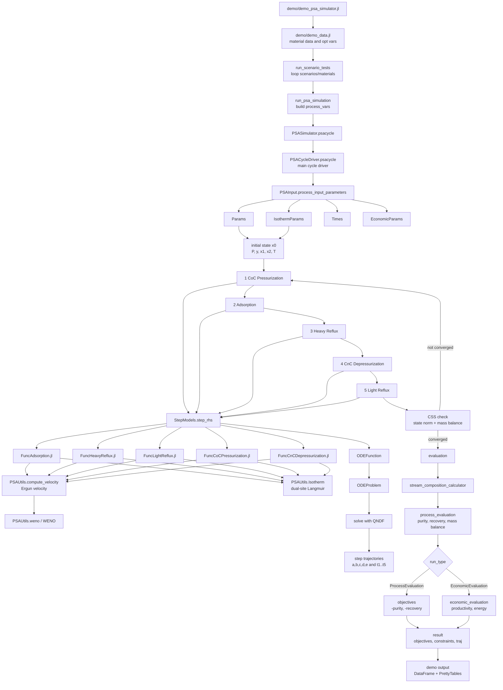

# PSASimulator.jl Calculation Flow

```mermaid
flowchart TD
    A["demo/demo_psa_simulator.jl"] --> B["demo/demo_data.jl<br/>material data and opt vars"]
    B --> C["run_scenario_tests<br/>loop scenarios/materials"]
    C --> D["run_psa_simulation<br/>build process_vars"]
    D --> E["PSASimulator.psacycle"]

    E --> F["PSACycleDriver.psacycle<br/>main cycle driver"]
    F --> G["PSAInput.process_input_parameters"]
    G --> H["Params"]
    G --> I["IsothermParams"]
    G --> J["Times"]
    G --> K["EconomicParams"]

    H --> L["initial state x0<br/>P, y, x1, x2, T"]
    I --> L

    L --> S1["1 CoC Pressurization"]
    S1 --> S2["2 Adsorption"]
    S2 --> S3["3 Heavy Reflux"]
    S3 --> S4["4 CnC Depressurization"]
    S4 --> S5["5 Light Reflux"]
    S5 --> CSS["CSS check<br/>state norm + mass balance"]
    CSS -->|not converged| S1
    CSS -->|converged| Eval["evaluation"]

    S1 --> SM["StepModels.step_rhs"]
    S2 --> SM
    S3 --> SM
    S4 --> SM
    S5 --> SM

    SM --> FA["FuncAdsorption.jl"]
    SM --> FHR["FuncHeavyReflux.jl"]
    SM --> FLR["FuncLightReflux.jl"]
    SM --> FCP["FuncCoCPressurization.jl"]
    SM --> FCN["FuncCnCDepressurization.jl"]

    FA --> U1["PSAUtils.compute_velocity<br/>Ergun velocity"]
    FHR --> U1
    FLR --> U1
    FCP --> U1
    FCN --> U1

    U1 --> U2["PSAUtils.weno / WENO"]

    FA --> U3["PSAUtils.Isotherm<br/>dual-site Langmuir"]
    FHR --> U3
    FLR --> U3
    FCP --> U3
    FCN --> U3

    SM --> O1["ODEFunction"]
    O1 --> O2["ODEProblem"]
    O2 --> O3["solve with QNDF"]
    O3 --> T["step trajectories<br/>a,b,c,d,e and t1..t5"]

    Eval --> P1["stream_composition_calculator"]
    P1 --> P2["process_evaluation<br/>purity, recovery, mass balance"]
    P2 --> P3{"run_type"}
    P3 -->|ProcessEvaluation| P4["objectives<br/>-purity, -recovery"]
    P3 -->|EconomicEvaluation| P5["economic_evaluation<br/>productivity, energy"]
    P4 --> OUT["result<br/>objectives, constraints, traj"]
    P5 --> OUT
    OUT --> R["demo output<br/>DataFrame + PrettyTables"]
```

